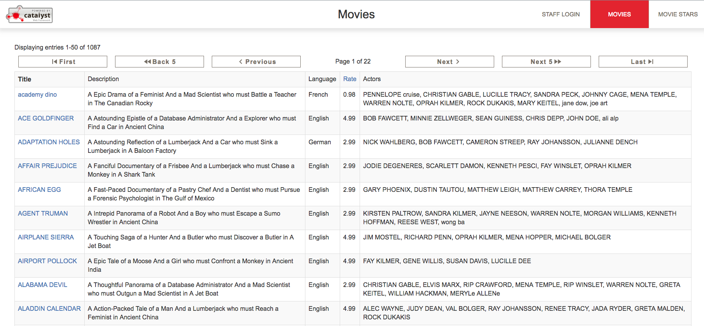
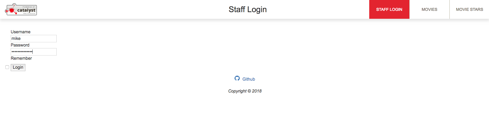
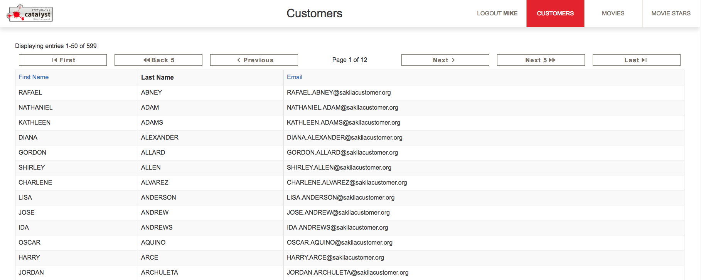
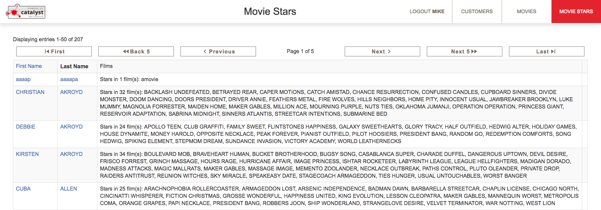
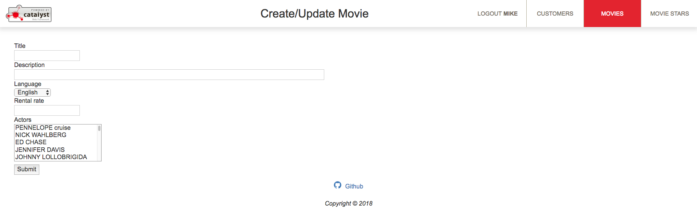
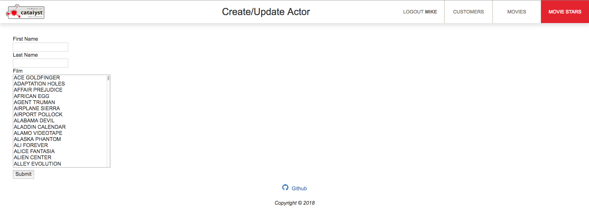

# Sakila web application

This is a basic CRUD application implemented using Catalyst.  It uses
DBIx::Class to access a MySQL sample database named 'sakila' that was 
downloaded from the [MySQL site](https://dev.mysql.com/doc/index-other.html) 
and included in this repository. The database has tables of movies, movie stars, customers and many others
that one would expect to see in a database system.

This application features pages that list the movies, movie stars and 
customers of the database system, as well as functionality to add, edit and delete them.
Its purpose is to demo the capabilities of a Catalyst web application.

# Setup

1. download and install [VirtualBox](https://www.virtualbox.org)
2. download and install [Vagrant](https://www.vagrantup.com)
3. download and extract or use [Git](https://git-scm.com) to clone this repository to your computer
4. type `cd sakila`, followed by `vagrant up` and wait for the message `done`
5. point your browser to http://localhost:3000 to view the application

The site looks best on modern browsers.

# Notes

There are certain restricted areas and activities within the application that you must log in to gain access.  
These restricted areas include access to the customer listings page and the ability to add, edit or delete 
records from the system.  Trying to perform these actions will automatically redirect you to the login form.

The top navbar has links to the login, logout, movie, movie star and customer listing pages.  Initially you 
will not see the logout or customer links in the navbar until after you login via the login link in the navbar.
The movie and movie star nav links have dropdowns to add a new movie or movie star to the system.

To login, click the 'STAFF LOGIN' link and use the username 'Mike' or 'Jon' and the password 'secretpassword'.
Once logged in, you will see the login link replaced by a 'LOGOUT JON' or 'LOGOUT MIKE' link.

The customer, movie and movie star pages are listings of the records in the system.  They are paged, and links 
exist at the top and bottom of the listings to skip forward and back through the pages.  There are also column 
headers, and the record listings are ordered by the column header that is in bold fontface.  Some column headers 
are clickable, and clicking it will reorder the records by that column.  On the movie and movie star listing 
pages, the movie title and movie star name are clickable, and clicking them will let you edit the record. 

To delete a movie star, click the 'Delete' link on the right of the record row.  The delete link will only show if 
the movie star does not star in any movies, so you must first edit the record and deselect his/her movies beforehand.  

The functionality to delete movies and customers has not been implemented.

# Author
Jeff T

